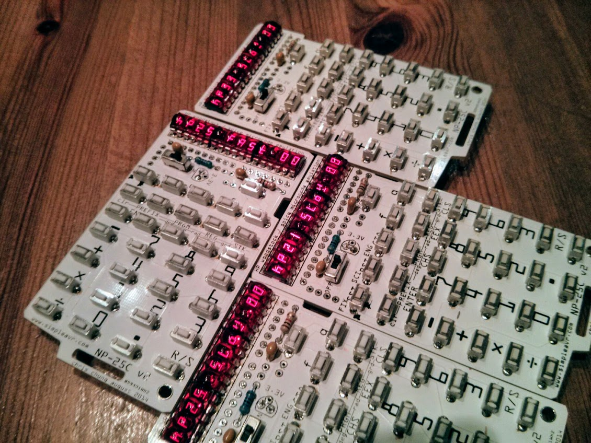
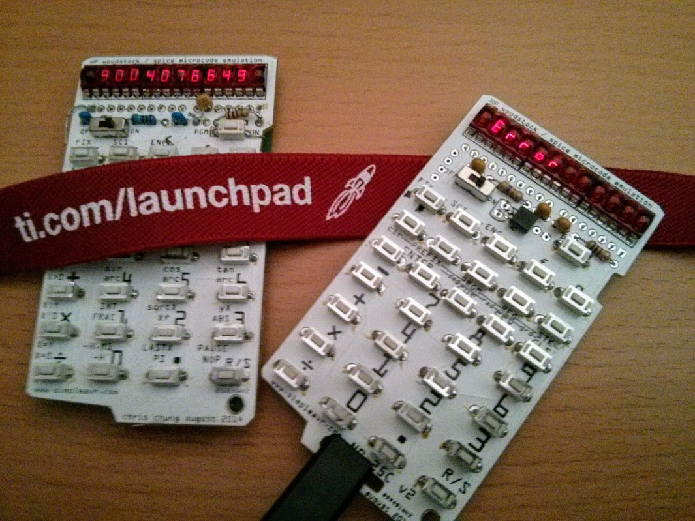
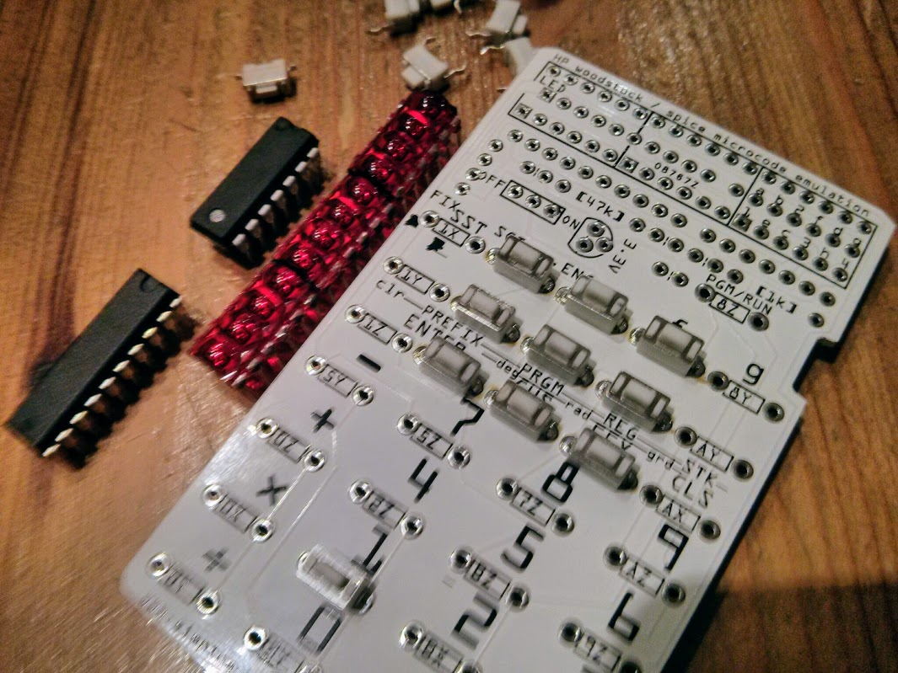
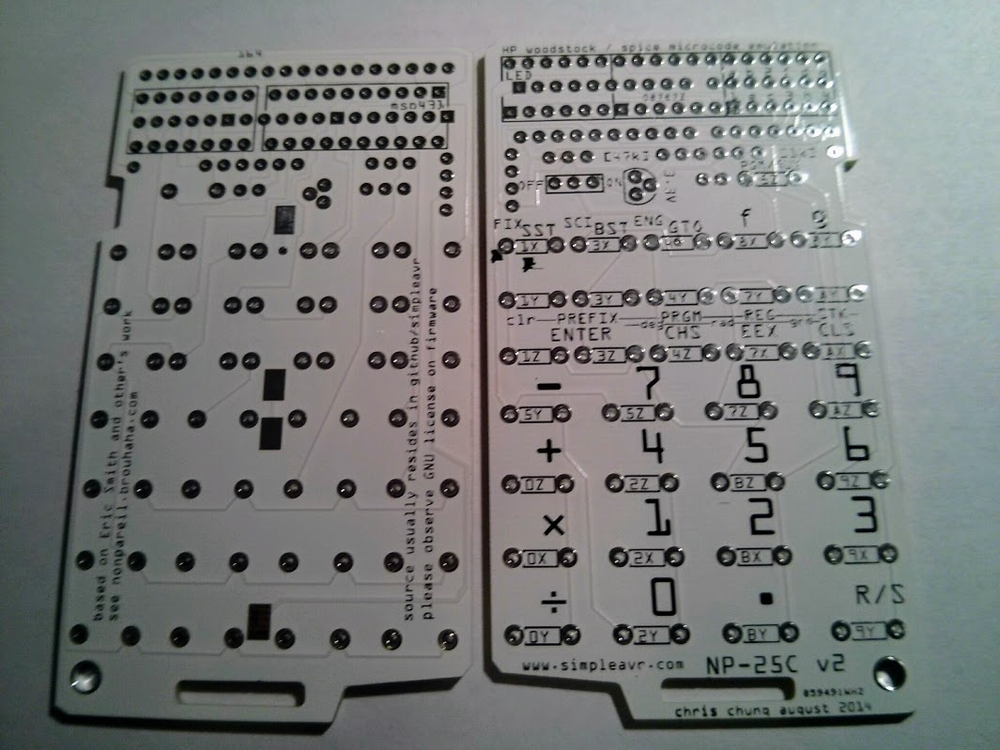
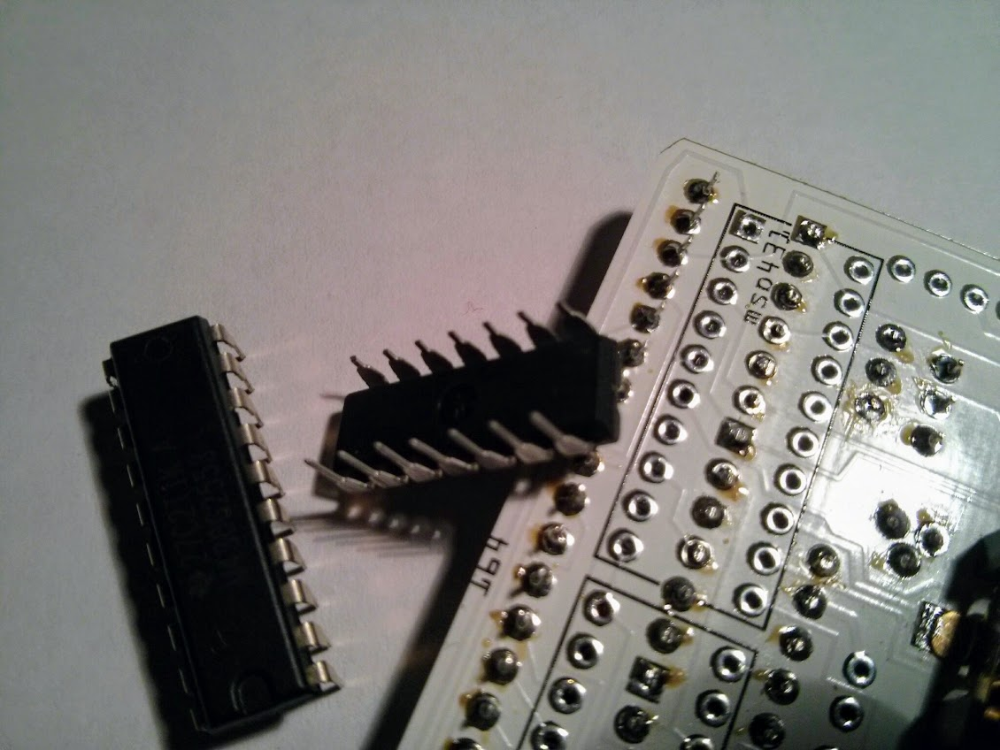
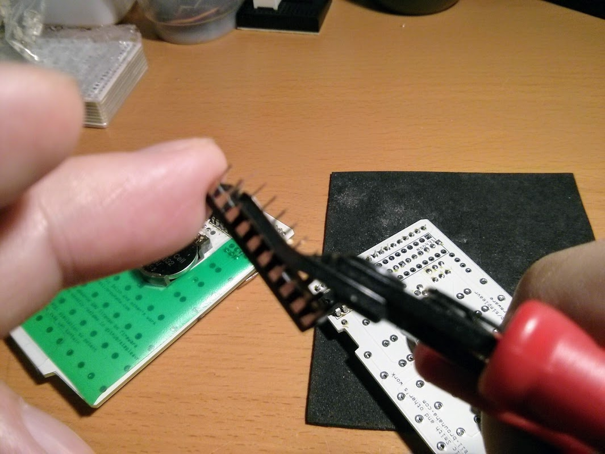
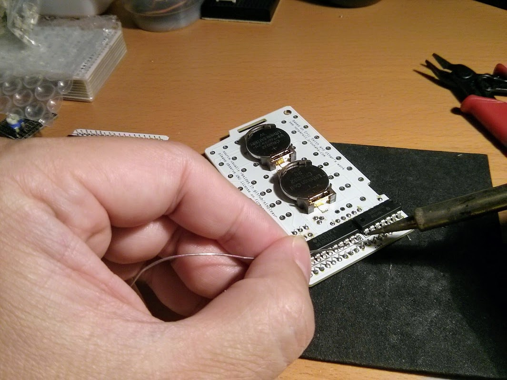

## NP25 Calculator


**msp430 Based Calculator Emulator for the HP-21, HP-25C, and HP-33C Calculators.**


<iframe width="560" height="315" src="https://www.youtube.com/embed/WwPM0slZro4" frameborder="0" allow="autoplay; encrypted-media" allowfullscreen></iframe>
<br><br>


  


### Description

This is a hardware realization of Eric Smith's Nonpareil microcode simulator. 

The objective of the project is to re-create popular 70's RPN calculators such as the HP Woodstock and Spice series. 

Another goal of this project is to have the design as simple as possible so that the project can be re-produced by the average electronic hobbyist. 

A low power MSP430G2553 is used in this project. The DIP profile allows easy soldering. Only through-hole components are used. LED multiplexing is done w/ a 74hc164 shift register. LED modules are direct driven w/ pulsing to eliminate the need of current drivers. 

LED modules are used to mimic the original 70's calculators and gives a retro look to the end product. 

### Application Notes


- press-n-hold 1st row, 5th column (from top) for hp33C
- press-n-hold 2nd row, 5th column for hp25C
- press-n-hold 3nd row, 5th column for hp21
- press-n-hold 4th row, 4th column for version info
- press-n-hold 1st row, 4th column to show greetings
- press-n-hold 1st row, 3rd column to edit greetings, use 0-9 to enter numbers and letters, Run/Stop to advance digit, Cls to abandon entry
- press-n-hold Pgm/Run toggle button to edit default startup settings, use 'F' key to select rom, 'G' key to select speed, Pgm/Run will save setting and exit setup


### Parts and Components

 


- 1× MSP430G25x3, TI 16bit MCU w/ 16K Flash 512 byte RAM
- 1× 74HC164, TTL shift register
- 3× HP QDSP-6064 LED Module from Sparkfun, 4 digit 7 segment led module
- 32× SMT Tactile Button 6x3mm, May be substituted w/ through-hole buttons
- 1× CR2032 Battery Holder


### Schematic


```
* runs off 3V button cell

           MSP430G25x3
         -----------------
     /|\|                 |
      | |                 |
      --|RST  digit 0 P2.6|--\
        |     digit 1 P1.0|--\       digits bus (12)
        |     digit 2 P2.7|-----//--+---------+
        |     digit 3 P1.1|--/      |         ~  3 units of 4 digits bubble led
        |     digit 4 P1.2|--/      |         |
        |     digit 5 P1.3|--/      |    +---------+ +---------+ +---------+
        |     digit 6 P2.0|--/      |    | % % % % | | % % % % | | % % % % |----+
        |     digit 7 P1.4|--/      ~    +---------+ +---------+ +---------+    |
        |     digit 8 P1.5|--/      |                                           |
        |     digit 9 P2.1|--/      | digits bus x 3 scan lines                 |
        |     digit a P1.6|--/      +-----+-----+---/ ~~ /--+-----+-----+-----+ |
        |     digit b P1.7|--/  _=_ | _=_ | _=_ | _/ ~~ /=_ | _=_ | _=_ | _=_ | |
        |      scan X P2.5|-----o o-+-o o-+-o o-+-/ ~~ /o o-+-o o-+-o o-+-o o-+ |
        |      scan Y P2.4|-----o o-+-o o-+-o o-+/ ~~ /-o o-+-o o-+-o o-+-o o-+ |
        |      scan Z P2.3|-----o o-+-o o-+-o o-/ ~~ /+-o o-+-o o-+-o o-+-o o-+ |
        |                 |                                                     ~
        |                 |      (32 tactile button)                            |
        |                 |                                                     |
        |                 |        +--------+                                   |
        |             P2.2|--+---->|CLK ~CLR|---+---- Vcc                       |
        |                 |  |     |       B|---+                               |
        |                 |  |     |  0(d)QA|-\                                 |
        |                 |  |     |  1(f)QB|-\                segments bus (8) |
        |                 |  -     |  2(b)QC|--------------//-------------------+
        |                 | | |    |  3(a)QD|-/
        |                 | | |1k  |  4(g)QE|-/  74hc164 segment driver
        |                 |  -     |  5(e)QF|-/
        |                 |  |     |  6(c)QG|-/
        |                 |  +---->|A 7(h)QH|-/
        |                 |  |     +--------+
        |                 | === (102)    1 wire shift register via RC delay
        |                 | ===  1nF	 to shift 1, Hi-Low-Hi
        +-----------------+  |           to shift 0, Hi-Looooooow-Hi (>20us Lo)
                            ___
                            ///
```


### Printed Circuit Board


 


Create PCB board from the Fritzing design file included in my [github repository](https://github.com/simpleavr/NP25).

You will need to install [Fritzing](http://fritzing.org/home/) and learn how to use it.

Fabricate PCB yourself or order from a FAB house (export Gerber files from Fritzing).

Acquire parts from the components list.


### Soldering


The two layer PCB was designed to minimize component space, and as such, components are placed on both side of the PCB. The ICs and LED modules actually intrudes into each other's footprint as they are through hole components. To address this issue, both the ICs and the LED modules need to have their pins trimmed so that they do not protrude into the other side of the PCB.

 


It is best to place and solder the LED modules first. There are three of them and when finished soldering, use a wire cutter / trimmer to trim off the pins on the other side. This will allow proper placement of the ICs.

 


Next we need to trim the IC pins before placing them onto the PCB. As the other side of the through holes are blocked by the LED modules, they will not fit without trimming the pins.

 


With the ICs placed on the PCB. We could commence soldering them. This has to be done on the IC component (back) side instead of the usual solder (front) side. This is because the LED modules on the front side block the holes.

 


The rest of the components including the tactile switches and other passive components can be soldered the usual way.


### Software and Programming Tools


Acquire a MSP430 MCU programmer. We need this to program the MCU. Easiest and least expensive way is to get a [TI LaunchPad G2](http://www.ti.com/tool/MSP-EXP430G2) and use it as a programmer.

Download and install GCC compiler for MSP430. There are instructions on the web. You can also [install Energia](http://energia.nu) and use the GCC compiler in the bundle.


